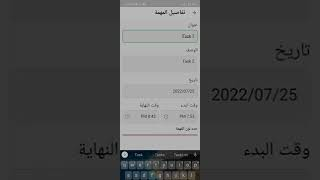

# m_todo_app

* Todo App.
## video

## images
# All Tasks
 
# Completed Tasks

# UnCompleted Tasks

# Favorite Tasks

# Add a Task

# Select Color Add a Task

# Details Task 

# Select Color Details Task 

# Search Task

# All Tasks Arabic 1

# Completed Tasks arabic

# Add Task Arabic

# Edit Task Arabic

