# m_todo_app

* Todo App.
## video

<video src="github_assets/video.mp4" controls="controls" style="max-height: 520px; max-width:520">
</video>
## images
# All Tasks
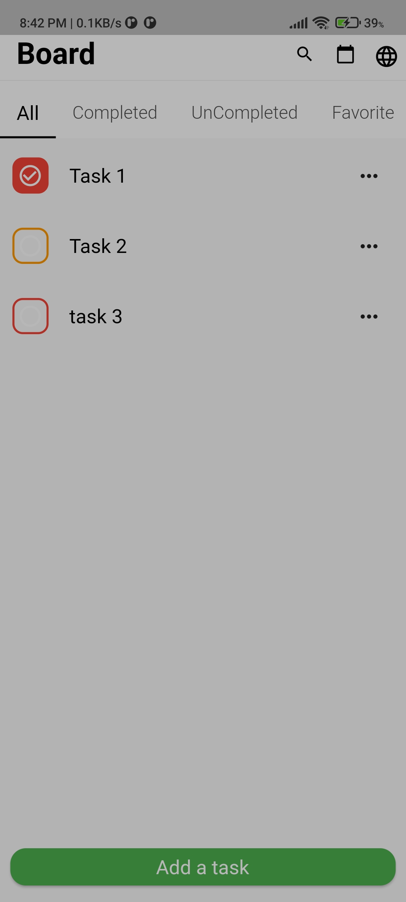
# Completed Tasks
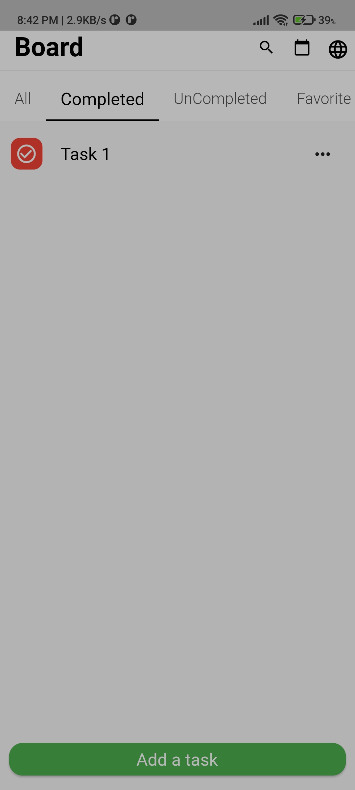
# UnCompleted Tasks
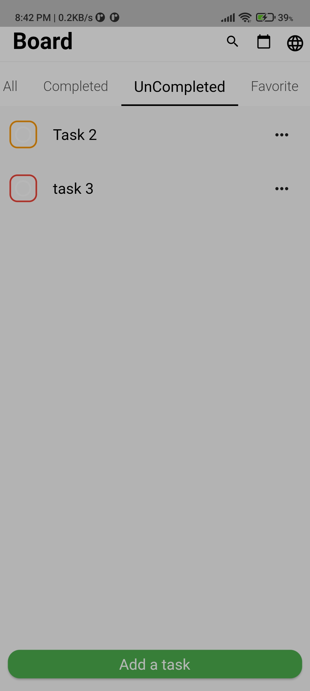
# Favorite Tasks
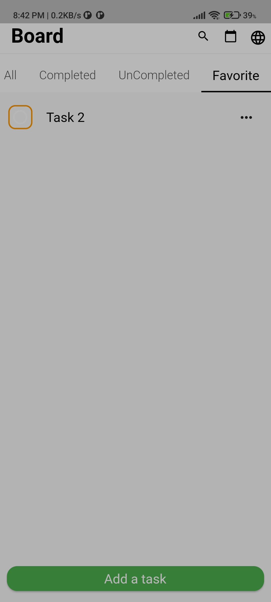
# Add a Task
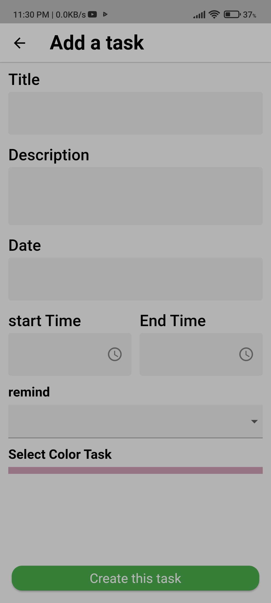
# Select Color Add a Task
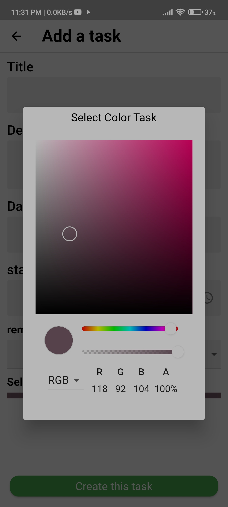
# Details Task 
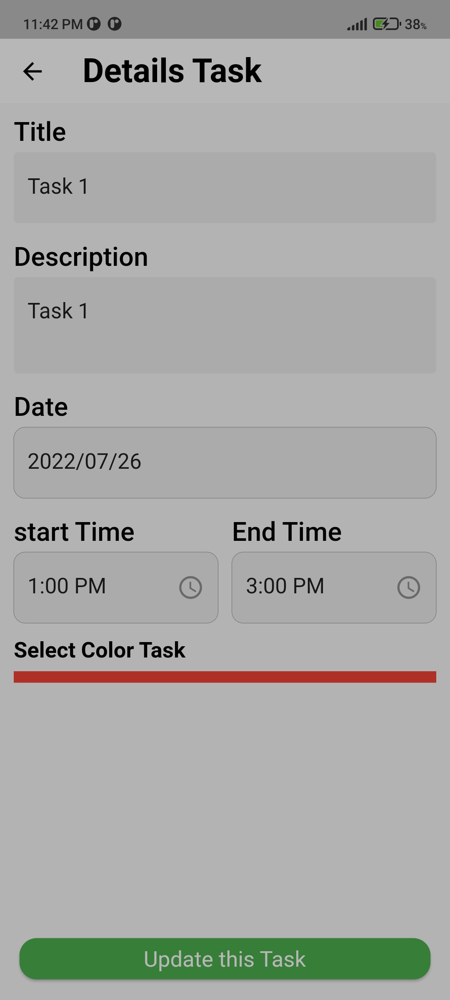
# Select Color Details Task 
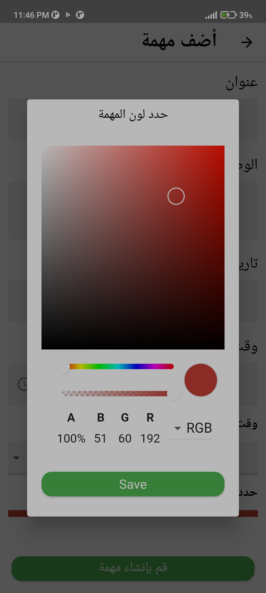
# Search Task
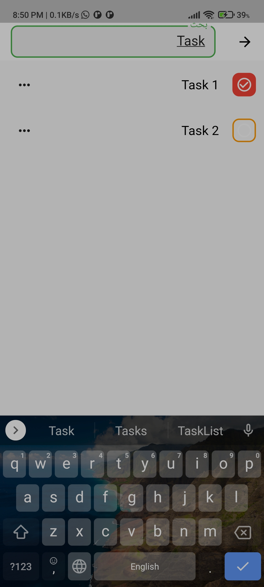
# All Tasks Arabic 1
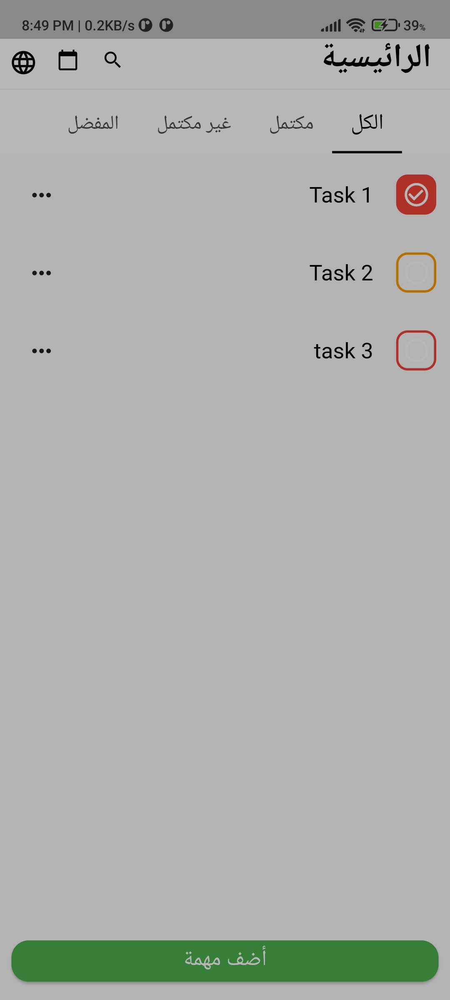
# Completed Tasks arabic
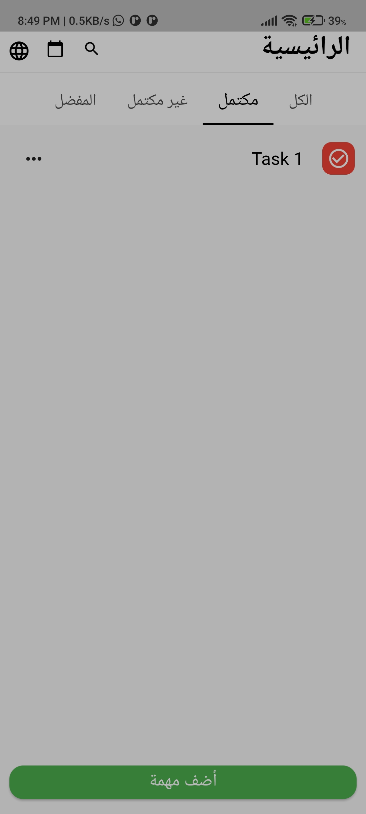
# Add Task Arabic
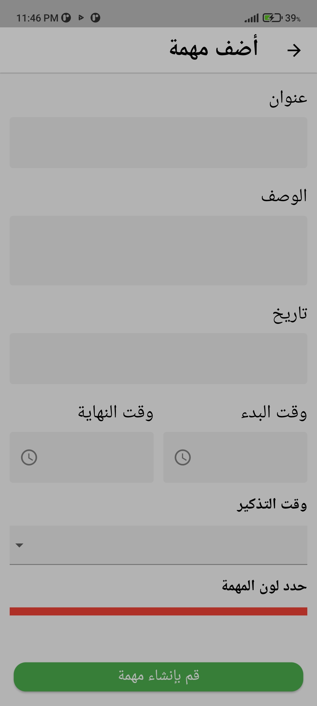
# Edit Task Arabic
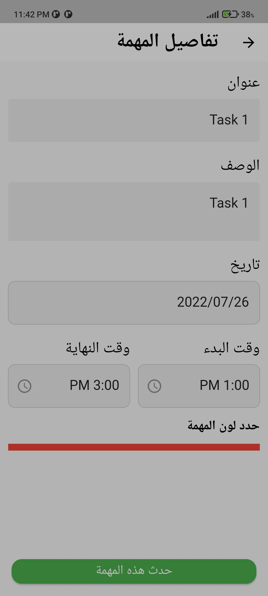

